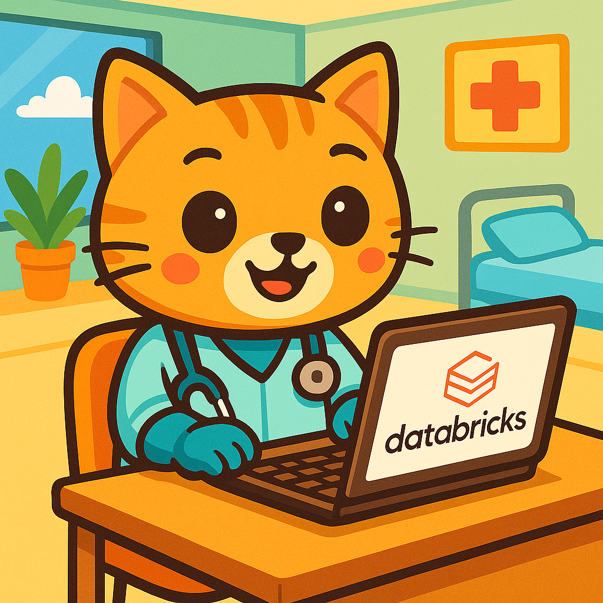

# Clinical Coding Agentic System Demo

An agentic AI system for automated clinical coding using ICD-10 standards with multi-agent workflows, HL7 data processing via Lakeflow, and vector search on Databricks.

## Overview

This Databricks demo implements an intelligent clinical coding system that leverages agentic AI workflows to automate the process of assigning ICD-10 codes to clinical narratives. The system uses Lakeflow declarative pipelines for HL7 data ingestion, vector search for ICD-10 document retrieval, and a multi-agent approach where Genie agents retrieve structured patient data and Vector Search agents map clinical text to appropriate ICD-10 codes.

## Features

- **Lakeflow Declarative Pipeline**: Automated HL7 data ingestion and transformation using Databricks Lakeflow
- **HL7apy Integration**: Custom UDF for parsing HL7 messages using the hl7apy library
- **Foundation model API**: Access the SOTA model on Databricks
- **Vector Search**: ICD-10 PDF processing with text extraction, embedding generation, and vector database storage
- **Multi-Agent Architecture**: 
  - **Genie Agent**: Retrieves structured HL7 patient data from processed tables
  - **Vector Search Agent**: Retrieves ICD-10 definition text chunks and maps clinical text to ICD-10 codes

